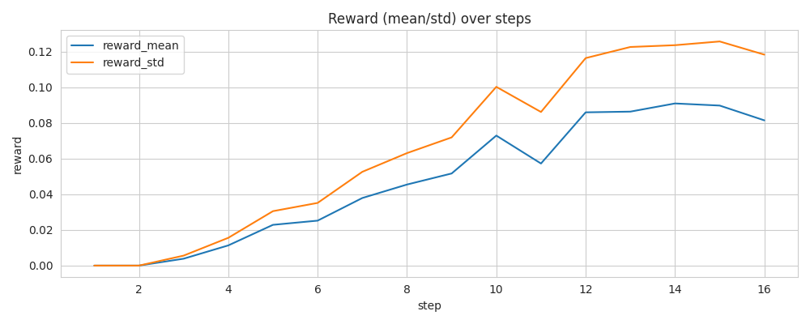

## RLHF Run Diagnostic Report

Generated: 2025-12-13T05:38:15.679079Z

**Trainer:** DPO | **Status:** Unstable

### Run Summary
- Steps: 16

- Final DPO Loss: 0.6607
- Mean Win Rate: 87.5%

### Key Insights

1. [HIGH] KL exceeded hard cap (0.30) at steps like [2, 3, 4, 5, 6]... (steps: [2, 3, 4, 5, 6, 7]...)
   *Ref: Schulman et al. (2017) 'PPO', Section 4*

2. [HIGH] Policy cosine to SFT dropped below 0.88. (steps: [2, 3, 4, 5, 6, 7]...)

3. [MEDIUM] KL shows high short-term volatility. (steps: [3, 4, 5, 6, 7, 8]...)

4. [MEDIUM] Instability hotspot detected around step ~16. (steps: [16])

5. [MEDIUM] Win rate shows high volatility (std=0.58), indicating inconsistent preference learning.

### Recommended Actions

- Adjust KL schedule or reduce learning rate.

- Increase KL strength or add anchor tasks to reduce drift from reference.

- Increase batch size or use gradient clipping; consider reward smoothing.

- Win rate unstable: increase batch size for more stable gradient estimates.

### Plots

