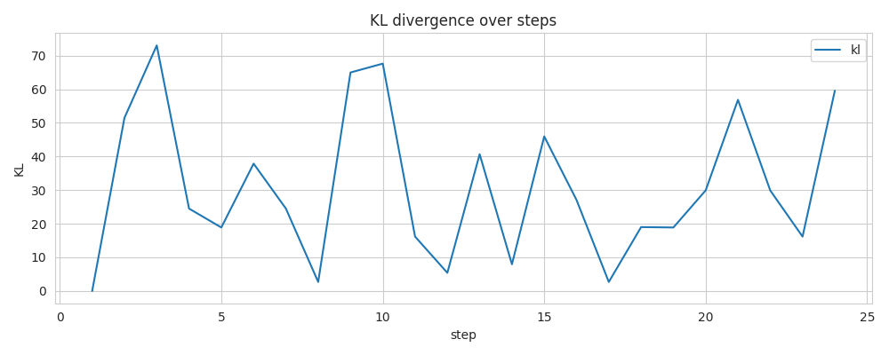
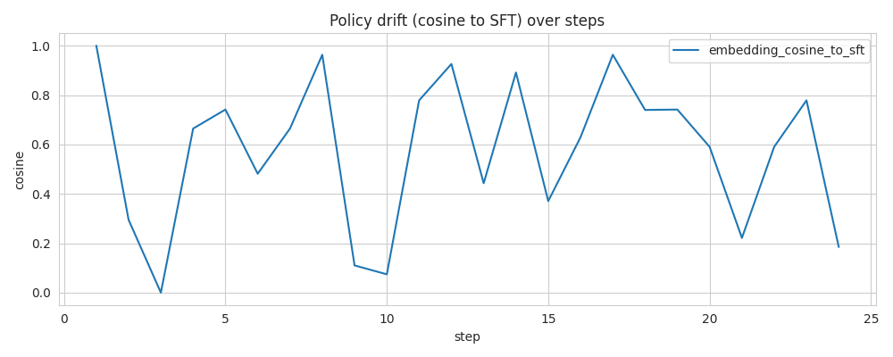

## RLHF Run Diagnostic Report

Generated: 2025-12-13T05:19:38.252235Z

**Trainer:** DPO | **Status:** Unstable

### Run Summary
- Steps: 24

- Final DPO Loss: 0.6931
- Mean Win Rate: 66.7%

### Key Insights

1. [HIGH] KL exceeded hard cap (0.30) at steps like [2, 3, 4, 5, 6]... (steps: [2, 3, 4, 5, 6, 7]...)
   *Ref: Schulman et al. (2017) 'PPO', Section 4*

2. [HIGH] Policy cosine to SFT dropped below 0.88. (steps: [2, 3, 4, 5, 6, 7]...)

3. [HIGH] Instability hotspot detected around step ~15. (steps: [15])

4. [HIGH] DPO loss stuck at ~0.693 (random chance). Model may not be learning preferences.
   *Ref: Rafailov et al. (2023) 'DPO', Section 4.2 - Loss at ln(2) indicates no preference signal*

5. [MEDIUM] KL shows high short-term volatility. (steps: [3, 4, 5, 6, 7, 8]...)

6. [MEDIUM] Win rate shows high volatility (std=0.53), indicating inconsistent preference learning.

7. [LOW] DPO loss has plateaued; consider adjusting learning rate or beta.

### Recommended Actions

- Adjust KL schedule or reduce learning rate.

- Increase KL strength or add anchor tasks to reduce drift from reference.

- Increase batch size or use gradient clipping; consider reward smoothing.

- DPO loss at random chance: increase learning rate 2-5x, check data quality, or reduce beta.

- DPO loss plateaued: try learning rate warmup/decay or adjust beta parameter.

- Win rate unstable: increase batch size for more stable gradient estimates.

### Plots

