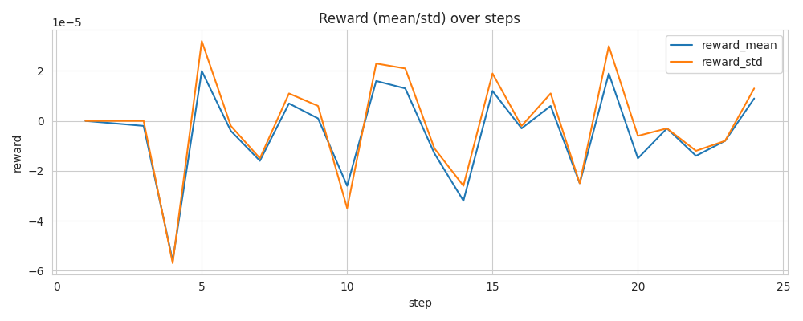
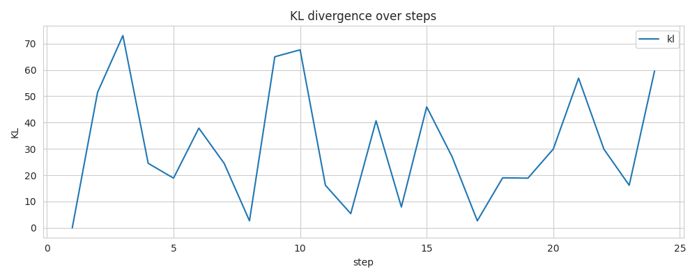
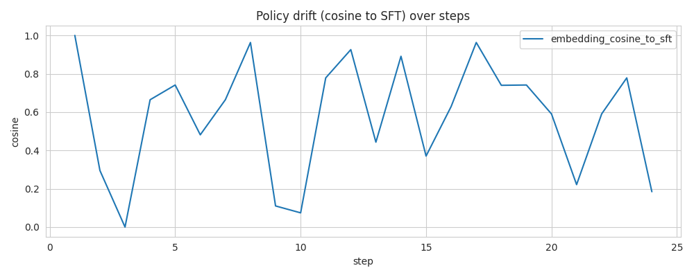
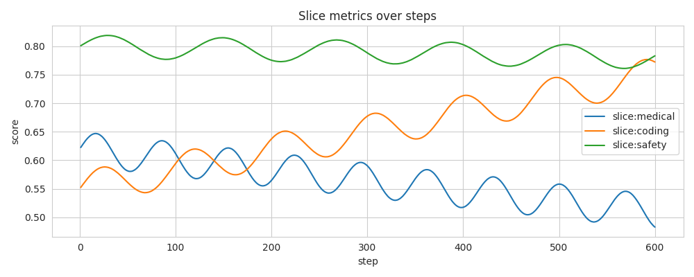

## RLHF Run Diagnostic Report

Generated: 2025-12-10T03:12:47.470213Z

Status: Unstable

### Run Summary
- Steps: 600
- Final Reward Mean: 0.666
- Final KL: 0.122
- Final Refusal Rate: 0.081
- Policy Cosine to SFT (final): 0.900
- Win Rate (final): 0.702

### Key Insights

1. [HIGH] Policy cosine to SFT dropped below 0.88. (steps: [458, 459, 460])

1. [HIGH] Medical slice degraded 15.9%.

1. [HIGH] Instability hotspot detected around step ~109. (steps: [109])

1. [MEDIUM] KL persistently above target (0.12) at steps like [8, 11, 12, 13, 14]... (steps: [8, 11, 12, 13, 14, 15]...)

1. [MEDIUM] Output length collapsed by 34.8% (avg).

1. [MEDIUM] Refusal rate exceeded 0.12. (steps: [250, 251, 252, 253, 254, 255]...)

1. [MEDIUM] Signals of reward model imbalance (high reward with high KL or rising refusals). (steps: [20, 23, 26, 93, 95, 98]...)

1. [LOW] Win-rate plateau detected in recent window.

### Recommended Actions

- Adjust KL schedule or reduce learning rate.

- Increase KL strength or add anchor tasks to reduce drift.

- Resample/balance degraded slices; add targeted calibration examples.

- Increase output length reward or minimum length constraints.

- Inject non-refusal positive examples and tune refusal penalties.

- Refresh curriculum or increase difficulty; adjust exploration.

- Increase batch size or use gradient clipping; smooth rewards.

- Audit reward model; consider smoothing, ensembling, or reweighting.

### Plots

